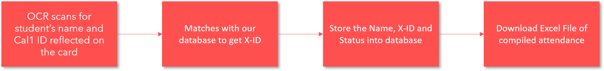

# Entrepreneurial Leadership Class

### Team 8 - Pentagonia

Team Members: Eric | Glenn | Kenzo Tan | Constance | Thiago

#### Instructional Menu for Attendy

----------------------------------

In our team's Attendy product, we used Optical Character Recognition (OCR) technology which uses your very own laptop's webcam and scan the students' Cal1 Card and followed by a compiled Excel file to download for the entire attendance process.

> Our product is accessible via  https://attendygeofi.herokuapp.com/
>
> Alternatively, you may also do a ``` npm start ``` and run the web-application on http://localhost:3000

Here is our Technical Flow of the product:



Here is our Instructional Guide for the product:

**Please note that the following journey will be you as an Professor / TA taking attendance.**

1. Open Google Chrome
2. Head over to ``` https://attendygeofi.herokuapp.com/ ``` for the Attendy Software


3. On this page, the user has the option to login / signup / retrieve forgotten password

   The software ideally allows students to login and find out how much attendance did they hit for the course.

   In this product, we will be focusing on the TA's usage of the software as it is the main focus of this project.


4. Students / TA / Professors will be able to sign up for a new account and the back-end system will automatically determines whether are you a Student / TA / Professor which will provide a variety of administrative permissions.

5. Go back to the login page, and sign in with the dummy administrator account. Please do note that both username and password are **case-sensitive**.

   > username: ADMIN
   >
   > password: 123


6. In this page, you will be able to see all of the available classes which are attached to Entrepreneurial Leadership Class. Select the class that you would like to start to take attendance 


7. In this page, 

   > ``` Start Attendance ``` allows you to start the marking attendance session. Any students who come over and take attendance will be automatically marked as *Punctual*
   >
   > ``` Late Attendance ``` allows you to switch the status of marking attendance to late once the class has started 10 minutes after the official time. Subsequent students who came over and take attendance will be automatically tagged as *Late*
   >
   > ``` Run OCR ``` will allow the system to take a snapshot of the Cal1 Card and run an algorithm to scan the card for ID.
   >
   > ``` End Session ``` allows you to close off the attendance totally and any students who did not come and take attendance during the course of the lesson will be automatically marked as *Absent*


8. Firstly, click on ``` Start Attendance ``` button to initialize the session and the student will position their card on the webcam. You can see that "Status: Punctual" has appeared and it is to tell you the current status of the marking attendance. If you were to click on ``` Late Attendance ``` the Status will change to Late.

   The screen tagged with Video Input allows student to see the positioning of the card. Next, once the card is position nicely, student can press on ``` Run OCR ``` to initialize the marking attendance process.


9. After the scanning is completed by the system in about 2 - 3 seconds, the system will show a confirmation text saying that "Attendance Taken Successfully (Student ID)"
10. After the end of the lesson, you can end the attendance marking session via clicking on the ``` End Session ``` button.


11. The system will automatically generate an Excel sheet ready for you to download to consolidate all the attendance together. All students that did not came over to mark attendance will be automatically tagged as *Absent*


12. The excel sheet will be automatically compile all the students' name, student ID and their status into a format that you are currently using right now.

​                                                                            

-----------------------------

​                                                                     End of Instructional 